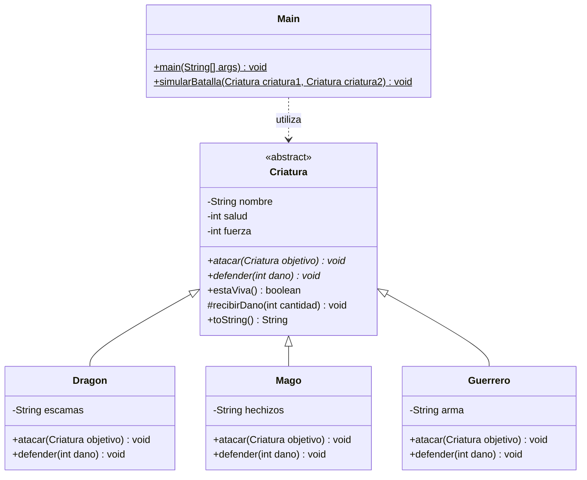

# parcial2
Parcial 2 de Programación ll, Sistema de batallas.

## Integrantes

- Alejandro Mosquera Corrales
- Angel Esteban Cuenu Chachinoy

## Diagrama UML

```mermaid
classDiagram
    direction TB

    class Criatura {
        <<abstract>>
        -String nombre
        -int salud
        -int fuerza
        +atacar(Criatura objetivo) void*
        +defender(int dano) void*
        +estaViva() boolean
        #recibirDano(int cantidad) void
        +toString() String
    }

    class Dragon {
        -String escamas
        +atacar(Criatura objetivo) void
        +defender(int dano) void
    }

    class Mago {
        -String hechizos
        +atacar(Criatura objetivo) void
        +defender(int dano) void
    }

    class Guerrero {
        -String arma
        +atacar(Criatura objetivo) void
        +defender(int dano) void
    }

    class Main {
        +main(String[] args) void$
        +simularBatalla(Criatura criatura1, Criatura criatura2) void$
    }

    Criatura <|-- Dragon
    Criatura <|-- Mago
    Criatura <|-- Guerrero
    Main ..> Criatura : utiliza
```
